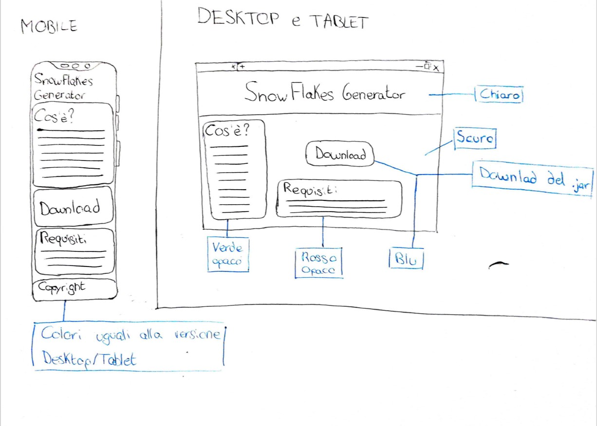
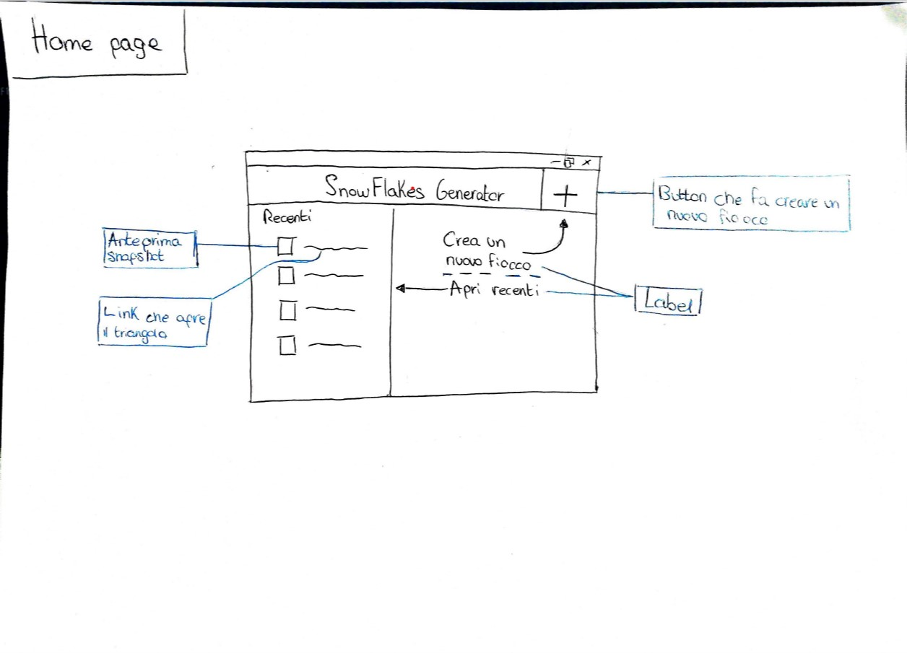
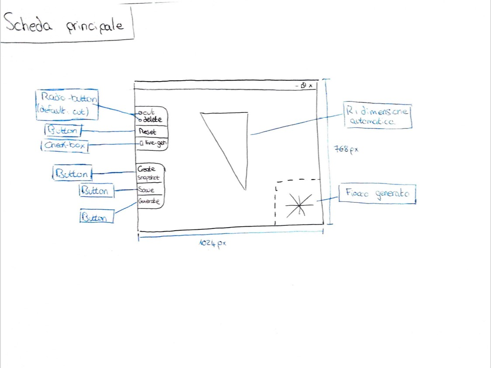
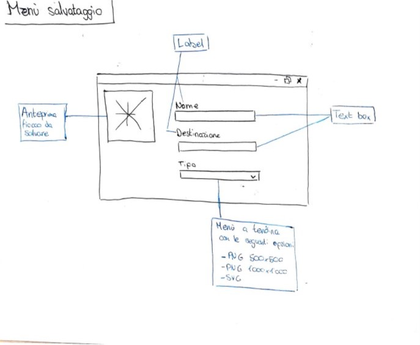

# Fiocco Di Neve
## Introduzione
---
### Informazioni sul progetto
- Matteo Arena
- Luca Muggiasca e Geo Petrini, <i>supervisori</i>
- SAM, Informatica, Modulo 306
- 06/09/2019 - 20/12/2019
### Abstract
Il progetto Fiocco di Neve è un progetto da realizzare nel primo semestre del terzo anno nella Scuola Arti e Mestieri di Trevano della sezione Informatica. Questo progetto consiste nel realizzare un fiocco di neve partendo da una base rettangolare (con angoli 30, 60, 90)che poi verrà specchiato fino a creare il riusltato.
### Scopo
Fare un programma che da un triangolo ritagliato dall'utente generi un fiocco di neve che può essere salvato o modificato.

## Analisi
---
### Analisi del dominio
Possibilmente il programma finale dovrebbe essere facilmente intuibile ed utilizzabile pure a persone inesperte di questo settore.
### Analisi e specifica dei requisiti
I requisiti sono elencati nella seguente tabella: 
[requisiti](requisiti.md)
### Use case
### Pianificazione
[Gantt Iniziale](FioccoIniziale.pdf)
[Gantt Finale](FioccoAggiornato.pdf)
### Analisi dei mezzi
I mezzi disponibili per questo progetto sono:
 
1. Computer Personale (Acer Aspire 5)
2. JDK e JRE versione 12.0.2
3. Server Infomaniak
## Progettazione
---
### interfaccia grafica 
- <b>Sito Web</b>
     
    Il Sito Web conterrà una guida veloce (quick guide) sul programma e il link per scaricarlo. Il collegamento sarà a GitHub dove prendererà il file .jar, invece in github sarà disponibile anche il .class. Il sito avrà circa il seguente layout:
     
    
    Come si può vedere dal layout il sito sarà disponibile anche da mobile è sarà comunque scaricabile il programma. Nonostante questo però per eseguirlo bisognerà spostarsi su un computer.
- <b>Programma</b>
     
    Il programma si avvierà con una schermata grande 1024px x 768px e presenterà 3 diverse interfacce, ovvero:
     
         La schermata che si aprirà quando lanceremo il programma. Da qui sarà possibile aprire i fiocchi di neve recenti (in caso che non ci siano la schermata di sinsitra comparirà vuota). Inoltre in alto a destra sarà presente un bottone con un "+" che ci permetterà di creare un nuovo fiocco di neve. Quando apriamo un file recente non verrà aperta l'immagine ma il triangolo con i tagli, questo verrà salvato ogni volta che salveremo il fiocco di neve o quando creeremo uno snapshot. 
        
        

        Nella scheda principale sarà possibile modificare il triangolo in modo da creare il fiocco di neve perfetto. Di default premendo sul triangolo creeremo un punto (che con tutti gli altri faranno il poligono per taglia il triangolo), ma è possibile anche eliminare i punti selezionato il radio-button "cut" e spostarli tenendone premuto uno e muovendo il mouse. Premendo il tasto reset il triangolo verrà ripristinato alla struttura iniziale. Spuntando il check box "live generation" sarà possibile visualizzare il fiocco di neve mentre aggiungiamo punti al triangolo e premendo su create snapshot faremo un salvataggio del triangolo attuale (se presenti due dello stesso il più vecchio verrà sovrascritto). Il bottone generate genererà il fiocco di neve (solo se live-generation sarà disattivato) senza salvarlo e il bottone save porterà alla schermata di salvataggio.
        
        Il menù di salvataggio conterrà in alto a sinistra un'anteprima del fiocco di neve che avremo appena creato mentre a destra le impostazioni di salvataggio. Queste opzioni saranno <i>Nome</i> (il nome del fiocco di neve, default SnowFlake \<idDelFiocco>), <i> Destinazione </i> (la destinazione dove salvare il fiocco, senza valore o con valore errato da errore), <i>Tipo</i> (a scelta tra png 500 x 500, png 1000 x 1000, svg; default png 500x500).
        
### Struttura
Il programma si basa su una classe che rappresenta il Frame e altre 3 che rappresentano le altre schermate (vedi sopra) e le disegna sopra al Frame.
## Implementazione

