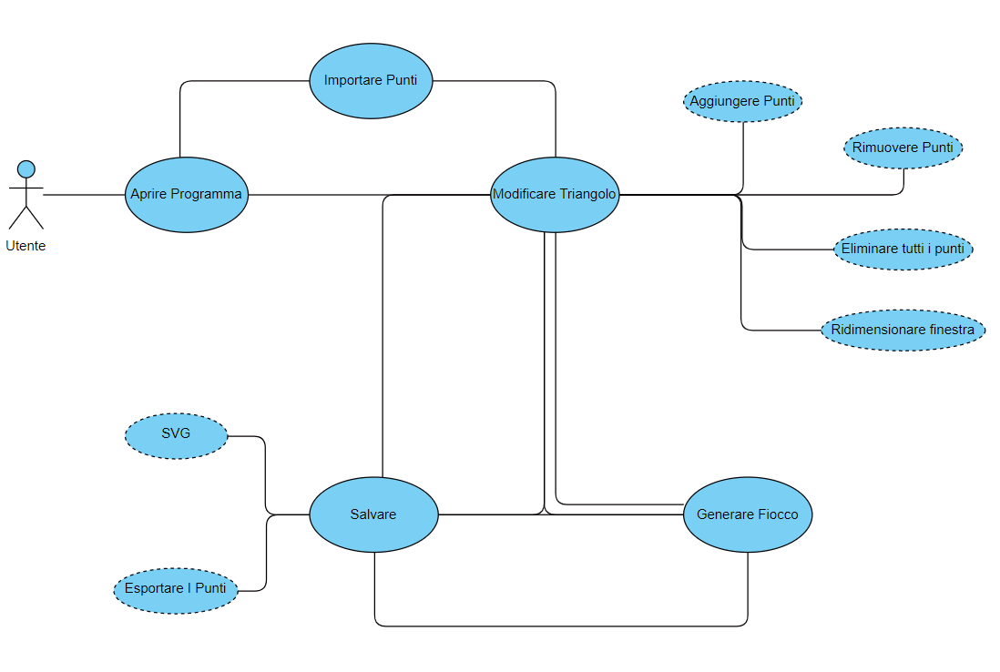

1. [Introduzione](#introduzione)
  - [Informazioni sul progetto](#informazioni-sul-progetto)

  - [Abstract](#abstract)

  - [Scopo](#scopo)

1. [Analisi](#analisi)

  - [Analisi del dominio](#analisi-del-dominio)
  
  - [Analisi dei mezzi](#analisi-dei-mezzi)

  - [Analisi e specifica dei requisiti](#analisi-e-specifica-dei-requisiti)

  - [Use case](#use-case)

  - [Pianificazione](#pianificazione)

1. [Progettazione](#progettazione)

  - [Design dell’architettura del sistema](#design-dell’architettura-del-sistema)

  - [Design dei dati e database](#design-dei-dati-e-database)

1. [Implementazione](#implementazione)

1. [Test](#test)

  - [Protocollo di test](#protocollo-di-test)

  - [Risultati test](#risultati-test)

  - [Mancanze/limitazioni conosciute](#mancanze/limitazioni-conosciute)

1. [Consuntivo](#consuntivo)

1. [Conclusioni](#conclusioni)

  - [Sviluppi futuri](#sviluppi-futuri)

  - [Considerazioni personali](#considerazioni-personali)

1. [Sitografia](#sitografia)

1. [Allegati](#allegati)

## Introduzione

### Informazioni sul progetto
  - <i>Progettista</i>: Matteo Arena
  - <i>Sviluppatore</i>: Matteo Arena
  - <i>Consulente</i>: Geo Petrini e Luca Muggiasca
  - <i>Cliente</i>: Geo Petrini e Luca Muggiasca
  - <i>Data di inizio</i>: 06.09.2019
  - <i>Data di consegna</i>: 20.12.2019
  - <i>Scuola</i>: SAM, sezione informatica.
  - <i>Materia</i>: Modulo 306.
  - <i>Classe</i>: I3AA.
### Abstract

  Con questo progetto si intende realizzare un programma che permetta di fare dei fiocchi di neve partendo da un semplice triangolo. Il procedimento è uguale a quello che faresti su carta, ma molto più facile e soprattutto più veloce.

### Scopo

  Gli scopi del progetto sono due, più esattamente:
  1) Fare un applicativo che permetta ad un utente di generare un fiocco di neve partendo da un semplice triangolo, facendoci dei tagli all'interno.
  2) Imparare a gestire al meglio un progetto, con la relativa documentazione e progettazione.

## Analisi

### Analisi del dominio

  Il progetto viene realizzato per imparare a gestire un mandato, soprattutto in preparazione del test di quarta ma anche per prepararci in caso che in un futuro lavoro dovremo utilizzare queste conoscenze.
### Analisi e specifica dei requisiti

  # Requisiti

  **Spiegazione elementi tabella dei requisiti:**

**ID**: identificativo univoco del requisito

**Nome**: breve descrizione del requisito

**Priorità**: indica l’importanza di un requisito nell’insieme del
progetto, definita assieme al committente. Ad esempio poter disporre di
report con colonne di colori diversi ha priorità minore rispetto al
fatto di avere un database con gli elementi al suo interno. Solitamente
si definiscono al massimo di 2-3 livelli di priorità.

**Versione**: Versione del requisito in base a come è stato concepito.

|ID   |Requisito            |Categoria      |Priorità|Versione|
|-----|---------------------|---------------|--------|--------|
|001|Creazione sito dal quale scaricare programma|Sito Web|4|1.0|
|002|Informazioni del sito con guida|Sito Web|5|1.0|
|003|Lista con requisiti di sistema|Sito Web|5|1.0|
|004|Dimensione minima finestra 1024X768|Struttura Programma|4|1.0|
|005|Il triangolo occupa sempre il 50% della finestra e si ridimensiona|Struttura Programma|6|1.0|
|006|Con tasto sinistro o touch si aggiunge un punto|Funzionalità|2|1.0|
|007|Scelta del poligono con cui tagliare (quadrato, cerchio, triangolo,...)|Funzionalità+|2|1.0
|008|Bottone reset dei punti|Funzionalità|2|1.0|
|009|Switch per cambiare da aggiungere punto a eliminare|Funzionalità+|4|1.0|
|010|Spostamento dei punti tramite tasto sinistro prolungato|Funzionalità+|4|1.0|
|011|Generazione live a scelta (con checkbox)|Funzionalità+|5|1.0|
|012|Bottone genera che non salva ma mostra solo l'anteprima|Funzionalità|3|1.0|
|013|Salvataggio fiocco in png (con la relativa dimensione) o svg in una specifica cartella|Funzionalità|3|1.0|
|014|Dimensioni PNG 500 o 1000 (quadrate)|Funzionalità|5|1.0|
|015|Scelta del formato da salvare per l'immagine del fiocco|Funzionalità|4|1.0|
|016|Creazione "snapshot" del fiocco per poterlo modificare|Funzionalità|4|1.0|
|017|Salvataggio dei triangoli modificati in CSV|Funzionalità|2|1.0|
|018|Menù con le varie cose a sinistra|Struttura Programma|2|1.0|
|019|Menù del programma con fiocchi recenti (miniatura)|Struttura Programma|5|1.0|
|020|Fornire .class in github ma per gli utenti fornire il jar|Sito Web|3|1.0|

  

### Use case

### Pianificazione

**Attività concepite**

**Gantt concepito**

**Attività effettive**

**Gantt effettivo**

### Analisi dei mezzi

**Linguaggio di programmazione**
- Java 12

**Hardware**
- Acer Aspire 5

**Software**
- Netbeans 11.1
- Visual Studio Code
- Git Hub Desktop

**Librerie**
- Java AWT
- Java Util
- Java Swing
- Java io
- Java nio
- SVGGraphics2D

L'applicativo è sviluppato per essere esguito su qualsiasi sistema operativo in circolazione che possa eseguire i file jar.
## Progettazione

### Design dell’architettura del sistema
 **Diagramma UML**
 

### Design delle interfacce

L'applicativo si dividerà in 4 schermate, più precisamente:

1. **Pagina Iniziale**
  
  Questa sarà la schermata visualizzata all'apertura del programma. A sinistra si possono trovare i fiocchi di neve recenti, in alto a destra il bottone per creare un nuovo fiocco di neve e in mezzo una breve descrizione del programma. 

2. **Schermata principale**
  
  SChermata dalla quale si potrà modificare il triangolo per poi generare il fiocco di neve. I bottoni sono posti in maniera che in alto ci siano quelli per la modifica dei punti ed in basso quelli per il salvataggio e la creazione del fiocco di neve. Questa finestra avrà una dimensione minima di 1024 x 768 pixel e il triangolo occuperà sempre il 50% della finestra. In basso a destra si potrà trovare un piccolo pannello dove, se selezioniamo l'opzione "live gen", verrà visualizzato il fiocco di neve live mentre modifichiamo i punti sul triangolo. I punti sul triangolo manterranno sempre la stessa proporzione, in modo che se si aggiunge un punto con la finestra di dimensione x quando si ridimensionerà i punti rimarranno sempre nello stesso posto senza modificare il taglio effettivo.

3. **Schermata di salvataggio**
  
  Grazie a questa schermata, richiamata dal bottone "Save" e "Create Snapshot" si potranno salvare i propri dati. La struttura è fatta in modo da essere intuitiva per l'utente, proprio per questo basilare.

4. **Sito Web**

Il Sito web è molto basilare ma contenente tutte le informazioni necessarie, molto probabilmente cambierà siccome verrà aggiunto un tab per la guida riguardate l'applicativo.

## Implementazione

### Elenco delle classi
 - <b>TriangleModel: </b> Questa classe è stata sviluppata per fare in modo che un triangolo tagliato può sempre essere ridisegnato in un altro pannello con dimensioni diverse e comunque mantenere sempre le stesse proporzioni (con anche i punti disegnati sopra). Per fare in modo che questo avvenga la classe richiederà sempre la dimensione del pannello corrente quando si interagisce con essa in modo da poter trasformare i punti aggiunti/rimossi nelle dimensioni del modello. Questa classe verrà poi richiamata da praticamente tute le altre all'interno del progetto, in questa maniera le varie classi possono condividersi il triangolo senza passarsi troppi argomenti ma semplicemente un oggetto TriangleModel.
 - <b>Preview</b>: Pannello che si occupa dio mostrare due tipi di preview durante il salvataggio, più specificatamente:
 1) <i>Salvataggio dei punti</i> quando verranno salvati i punti nel frame principale verrà affiancato un pannello contenente la preview del triangolo con i tagli.
 2) <i>Salvataggio del fiocco</i> quiando si salva l'immagine del fiocco di neve la preview cambierà e diventerà al posto del triangolo quella del fiocco di neve. Lo spazio occupato per entrambi sarà sempre lo stesso.
 - <b>TrianlgePanel</b>: Interagiscew con la classe TriangleModel, i listener per il mouse sono situati in questa classe, che poi passa i punti al TriangleModel e in caso di esportazione lo passa lui. In questa maniera la classe TriangleModel rimane estremamente pulita e facilmente riutilizzabile in altre classi completamente diverse.
 - <b>SaveFrame</b>: Frame di salvataggio, sia dei punti che del fiocco di neve (lo capisce grazie ad un valore booleano). In entrambi i casi però ci sarà diviso in due parti, a sinistra la preview di quello che si vuole salvare e a destra la scelta della directory e del nome del file.
 - <b>SnowFrame</b>: Frame contenente il fiocco di neve generato, la generazione avverrà tramite un metodo setter che si occuperà di prendere il triangleModel e poi lo ruoterà in modo da generarlo in maniera perfetta. Adottando questa maniera di generare il fiocco il programma si può permettere di generare il fiocco in live, ovvero mentre tagliamo il triangolo in automatico il fiocco viene rigenerato (grazie ad una interfaccia del TrianglePanel).
 - <b>TutorialFrame</b>: Frame che si occupa di dare una mini guida all'interno del programma all'utente, più specificatamente di ogni bottone che si visualizza a schermo e di ogni funzione. Questa guida è un poco meno completa di quella che si può trovare sul [sito ufficiale](http://www.samtinfo.ch/i17aremat/SnowFlake/).
 - <b>TriangleEditFrame</b>: Frame principale del programma, quello che parte quando si avvia. Ovviamente è anche quello che interagisce con tutte le altre classi a parte TriangleModel perché  con quello ci interagiscono tutte le altri classi.

### Ridimensionamento del triangolo e del poligono

Per ridimensionare il triangolo viene utilizzata la classe TriangleModel che, passandogli semplicemente la dimensione del pannello ritorna in automatico il triangolo che occupa il 50% dello spazio disponibile e il triangolo di taglio (se c'è).

Il metodo seguente è quello utilizzato per calcolare il triangolo che l'utente dovrà poi disegnare. Come si può notare il metodo è void, questo perché il triangolo non verrà calcolato unicamente quando lo si vuole disegnare ma ogni volta che si interagisce con la classe TriangleModel. Questo permette alla classe di sapere sempre su che triangolo sta lavorando l'utente e ridimensionare da solo il poligono di taglio.

    /**
     * Calcola il triangolo ridimensionato in base alla grandezza della
     * finestra.
     *
     * @param windowWidth Larghezza della finestra.
     * @param windowHeight Altezza della finestra.
     */
    private void calculateTriangleFromWindowSize(int windowWidth, int windowHeight) {
        double minimumWidthMargin = windowWidth * 1 / 3;
        double minimumHeightMargin = windowHeight * 1 / 4;
        double maximumWidth = windowWidth - minimumWidthMargin * 2.0;
        double maximumHeight = windowHeight - minimumHeightMargin * 2.0;

        double finalWidth = TRIANGLE_WIDTH * maximumHeight / TRIANGLE_HEIGHT;
        double finalHeight = maximumHeight;
        double startX = minimumWidthMargin;
        double startY = minimumHeightMargin;
        if (finalWidth > maximumWidth) {
            finalHeight = maximumWidth * TRIANGLE_HEIGHT / TRIANGLE_WIDTH;
            finalWidth = maximumWidth;
            startX = minimumWidthMargin + (maximumWidth - finalWidth) / 2.0;
        } else {
            startY = minimumHeightMargin + (maximumHeight - finalHeight) / 2.0;
        }

        int[] xCoordinates = new int[3];
        int[] yCoordinates = new int[3];
        xCoordinates[0] = (int) startX;
        xCoordinates[1] = xCoordinates[0] + (int) finalWidth;
        xCoordinates[2] = xCoordinates[1];
        yCoordinates[0] = (int) startY;
        yCoordinates[1] = yCoordinates[0];
        yCoordinates[2] = yCoordinates[0] + (int) finalHeight;

        userTriangle = new Polygon(xCoordinates, yCoordinates, 3);
    }

  Il poligono di taglio invece viene calcolato tramite i punti che si trovano sul triangolo di modello e il triangolo che sta utilizzando l'utente. Per fare questa magia il programma sfrutta semplicemente la proporzione tra i die triangoli.

    /**
     * Calcola e ritorna il poligono personalizzato.
     *
     * @param windowWidth Larghezza della finestra.
     * @param windowHeight Altezza della finestra.
     * @return Il poligono già pronto da disegnare.
     */
    public Polygon getCustomPolygon(int windowWidth, int windowHeight) {
        calculateTriangleFromWindowSize(windowWidth, windowHeight);
        int[] xCoordinates = new int[customPolygonDots.size()];
        int[] yCoordinates = new int[customPolygonDots.size()];
        for (int i = 0; i < customPolygonDots.size(); i++) {
            xCoordinates[i] = userTriangle.getBounds().x + (int) (customPolygonDots.get(i).getX() * userTriangle.getBounds().width / TRIANGLE_WIDTH);
            yCoordinates[i] = userTriangle.getBounds().y + (int) (customPolygonDots.get(i).getY() * userTriangle.getBounds().height / TRIANGLE_HEIGHT);
        }
        return new Polygon(xCoordinates, yCoordinates, customPolygonDots.size());
    }

### Aggiunta e rimozione dei punti

Anche l'aggiunta dei punti è completamente gestita dalla classe TriangleModel che richiede come parametro il punto che si vuole aggiungere e la dimensione della finestra. Sapendo queste informazioni il TriangleModel richiamerà il metodo calculateTriangleFromWindowSize, in modo da sapere su che triangolo sta operando, e proporizonerà in automatico i punti.

    /**
     * Date le dimensioni della finestra ricalcola un punto in modo da adattarlo
     * al triangolo di modello.
     *
     * @param dot Punto da adattare.
     * @param width Larghezza della finestra.
     * @param height Altezza della finestra.
     * @return Il punto adattato.
     */
    private Point getModelPoint(Point dot, int width, int height) {
        calculateTriangleFromWindowSize(width, height);
        double x = dot.getX() - userTriangle.xpoints[0];
        double y = dot.getY() - userTriangle.ypoints[0];

        double finalX = x * TRIANGLE_WIDTH / userTriangle.getBounds().width;
        double finalY = y * TRIANGLE_HEIGHT / userTriangle.getBounds().height;

        return new Point((int) finalX, (int) finalY);
    }
    /**
     * Aggiunge un punto al modello.
     *
     * @param dot Punto da aggiungere.
     * @param width Larghezza della finestra.
     * @param height Altezza della finestra.
     */
    public void addDotToCustomPolygon(Point dot, int width, int height) {
        customPolygonDots.add(getModelPoint(dot, width, height));
    }

La rimozione dei punti invece richiede un lavoro aggiuntivo alla classe TrianglePanel (contenente il TriangleModel), perché deve controllare se il mouse è all'interno dell'area del punto e passare come posizione non quella effettiva ma quella del punto sopra al quale ci si trova (la stessa tecnica viene utilizzata per muovere i punti).

    /**
     * Dice se un punto esiste nella lista di punti già presenti.
     *
     * @param position Punto da controllare.
     * @return Punto esistente, altrimenti 0,0.
     */
    private Point getPointInteressed(Point position) {
        Point res = new Point(0, 0);
        for (Point dot : dots) {
            if (dot.distance(position) <= POINT_RADIUS * 2) {
                return dot;
            }
        }
        return res;
    }

    public void mouseClicked(MouseEvent e) {
        if (addPoint) {
            Point p = e.getPoint();
            triangleModel.addDotToCustomPolygon(p, this.getWidth(), this.getHeight());
            dotInteressed = dots.size();
            repaint();
            addedAPoint();
        } else {
            Point p = getPointInteressed(e.getPoint());
            if (p.x != 0 && p.y != 0) {
                triangleModel.removeDotFromPolygon(p, this.getWidth(), this.getHeight());
                repaint();
                addedAPoint();
            }
        }
    }

### Salvataggio e importazione dei punti
I punti vengono salvati su un seplicissimo csv e la loro formattazione è in base al triangolo di modello, che è una costante all'interno della classe TriangleModel. Facendo questo approccio non c'è bisogno di salvarsi la dimensione della finestra al momento del salvataggio perché si saprà già al momento dell'apertura che sono stati salvati in base al triangle model. 

### Creazione del fiocco di neve
Il fiocco di neve viene generato partendo dal TriangleModel. Da esso viene sottratto l'area del poligono di taglio e poi viene specchiato (in caso che il triangolod debba essere specchiato) e girato per creare il fiocco. 

    private Shape rotateArea(int angle, Shape shape) {
        AffineTransform af = new AffineTransform();
        af.rotate(Math.toRadians(angle), triangle.xpoints[2], triangle.ypoints[2]);
        return af.createTransformedShape(shape);
    }

    /**
     * Permette di avere l'area specchiata.
     *
     * @return Il triangolo specchiato.
     */
    private Shape getFlippedArea(Area area) {
        AffineTransform first = new AffineTransform();
        first.scale(-1, 1);
        AffineTransform toCenter = new AffineTransform();
        toCenter.translate(-(triangle.xpoints[1]) * 2, 0);
        AffineTransform tot = new AffineTransform();
        tot.concatenate(first);
        tot.concatenate(toCenter);
        return tot.createTransformedShape(area);
    }

Una volta che si hanno questi due metodi non basta altro che usufruirne all'interno del metodo paint nella seguente maniera:

            for (int i = 0; i < 6; i++) {
                g2.fill(rotateArea((i - 1) * 60, getFlippedArea(finalArea)));
                g2.fill(rotateArea(i * 60, finalArea));
            }

### Cambiamento di design
  
  * **Pagina iniziale**: La pagina iniziale non esiste più, questa scelta è stata intrapresa a causa del fatoo che sarebbe stata inutile. Per rendere il programma meno complicato per l'utente questa schermata è stata assorbita dalla pagina principale (dove si modifica il triangolo).
  * **Pagina principale**: Nella pagina principale sono state aggiunte diverse funzioni, che sono necessarie per il corretto funzionamento del programma. I 2 menù non sono più divisi solo da un lato ma sono completamente separati (ora i bottoni che interagiscono con i punti sono a sinistra e gli altri a destra). Tra le cose aggiunte troviamo 

    1. *undo* per eliminare l'ultimo punto
    2. *Tutorial* mostra un mini tutorial all'utente sulle funzioni del programma
    3. *live-preview* è stata eliminata per renderla sempre attiva quando si genera il fiocco, infatti non si trova più in basso a destra ma in un'altra finestra (nel primo caso risultava molto piccolo e difficile da capire).
    4. *nome del triangolo corrente* sempre in basso a sinistra
    5. *posizione del mouse* in pixel e sempre leggibile in basso

* **Pagina di salvataggio**: La finestra di salvataggio è diventata la classica di Windows (per semplicità) ma affiancata dalla preview di quello che stiamo per salvare. Quando salviamo i punti la preview ci farà vedere il triangolo tagliato, mentre quando salviamo il fiocco la preview mostrerà il fiocco generato.

* **Sito Web**: come potevo dedurre dall'inizio il sito web è cambiato drasticamente, adesso è molto più esteso, con una guida, i requisiti e un'apposita finestra per il download. Oltre a tutto ciò è stato aggiunto anche un form per fare in modo che gli utenti possano chiedere aiuto all'autore o riferirgli dei bug
## Test

### Protocollo di test

|Test Case      | TC-001                               |
|---------------|--------------------------------------|
|**Nome**       |Provare programma |
|**Riferimento**|REQ-001                               |
|**Descrizione**|Scaricare il programma dal sito ufficiale e provarlo|
|**Prerequisiti**|Avere la base del sito web e il programma comlpetamente funzionante|
|**Procedura**     |Recarsi sul sito ufficiale, scaricarlo e provare le funzioni principali|
|**Risultati attesi** |Il programma dovrebbe funzionare normalmente come se avviato da NetBeans|

|Test Case      | TC-002                               |
|---------------|--------------------------------------|
|**Nome**       |Ridimensionare finestra|
|**Riferimento**|REQ-004                               |
|**Descrizione**|Controllare se si può diminuire la dimensione del programma sotto a 1024x768 pixel|
|**Prerequisiti**|Impostare la dimensione minima|
|**Procedura**     |Avviare programma, ridimensionare in piccolo. Se funziona: andare nelle impostazioni della macchina con il programma aperto e impostare la risoluzione dello schermo inferiore a 1024x768|
|**Risultati attesi** |Il programma dovrebbe rimanere della dimensione minima e nel secondo caso sforare dallo schermo|

|Test Case      | TC-003                               |
|---------------|--------------------------------------|
|**Nome**       |Aggiungere punti|
|**Riferimento**|REQ-006                               |
|**Descrizione**|Provare ad aggiungere punti al triangolo|
|**Prerequisiti**|Implementare la possibilità di aggiungere i punti|
|**Procedura**     |Avviare programma, cliccare sul panel e al di fuori per aggiungere dei punti|
|**Risultati attesi** |I punti dovrebbero aggiungersi unicamente all'interno del panel senza sforare|

|Test Case      | TC-004                               |
|---------------|--------------------------------------|
|**Nome**       |Reset punti|
|**Riferimento**|REQ-008                               |
|**Descrizione**|Testare il bottone reset|
|**Prerequisiti**|Implementare la possibilità di aggiungere i punti e il reset dei punti|
|**Procedura**     |Avviare programma, aggiungere punti, cliccare reset, aggiungere altri punti|
|**Risultati attesi** |I primi punti si dovranno eliminare tranquillamente e quando se ne aggiungeranno poi di nuovi i vecchi non dovranno ricomparire|

|Test Case      | TC-005                               |
|---------------|--------------------------------------|
|**Nome**       |Switch add e cut|
|**Riferimento**|REQ-009                               |
|**Descrizione**|Testare lo switch tra add e cut|
|**Prerequisiti**|Implementare la possibilità di aggiungere i punti e rimuoverli|
|**Procedura**     |Avviare programma, aggiungere punti, cliccare cut, eliminare punti esistenti, cliccare su add, aggiungere punti|
|**Risultati attesi** |I punti si dovrebbero aggiungere e rimuovere tranquillamente|

|Test Case      | TC-006                               |
|---------------|--------------------------------------|
|**Nome**       |Drag punti|
|**Riferimento**|REQ-010                               |
|**Descrizione**|Testare il drag dei punti|
|**Prerequisiti**|Implementare la possibilità di aggiungere i punti e muoverli|
|**Procedura**     |Avviare programma, aggiungere punti, tenere premuto su uno e muoverlo|
|**Risultati attesi** |I punti si dovrebbero spostare tranquillamente senza crearne degli altri|

|Test Case      | TC-007                              |
|---------------|--------------------------------------|
|**Nome**       |Anteprima live|
|**Riferimento**|REQ-011                               |
|**Descrizione**|Testare la generazione live|
|**Prerequisiti**|Implementare la generazione del fiocco|
|**Procedura**     |Avviare programma, aggiungere punti, generare fiocco, aggiungere nuovi punti, muoverne alcuni, rimuoverne altri e alla fine fare un reset|
|**Risultati attesi** |I punti dovrebbero rispondere correttamente ai comandi senza sollevare nessun problema|

|Test Case      | TC-008                              |
|---------------|--------------------------------------|
|**Nome**       |Salvataggio fiocco|
|**Riferimento**|REQ-013                               |
|**Descrizione**|Salvare il fiocco|
|**Prerequisiti**|Implementare il salvataggio del fiocco|
|**Procedura**     |Avviare programma, aggiungere punti, salvare il fiocco|
|**Risultati attesi** |Il fiocco si dovrebbe salvare|

|Test Case      | TC-009                              |
|---------------|--------------------------------------|
|**Nome**       |Snapshot|
|**Riferimento**|REQ-016                               |
|**Descrizione**|Giocare con gli snapshot|
|**Prerequisiti**|Implementare il salvataggio dei punti|
|**Procedura**     |Avviare programma, aggiungere punti, salvare lo snapshot, chiudere il programma, aprire il programma, aprire snapshot|
|**Risultati attesi** |Il programma dovrebbe riaprire il primo triangolo con i relativi tagli|

### Risultati test

|Test|Risultato|
|---|--|
|001|Successo|
|002|Successo|
|003|Successo|
|004|Successo|
|005|Successo|
|006|Successo|
|007|Successo|
|008|Successo|
|009|Successo|

### Mancanze/limitazioni conosciute

* **Salvataggio in PNG**: Il salvataggio in formato PNG non è stato possibile a causa del tempo esaurito.
* **Possibilità di usare più poligoni di taglio**: Requisito non rispettato a causa del fatto che la struttura del programma non permetteva questa opzione.

## Consuntivo

Il tempo di lavoro effettivo era giusto, anzi quasi abbondante. Il problema è stata la progettazione fatta in maniera poco curata e rispettata estremamente poco.

## Conclusioni

### Sviluppi futuri
  Magari l'aggiunta dei requisiti non rispettati.

### Considerazioni personali
  Grazie a questo progetto ho capito quanto una buona progettazione possa rendere un progetto molto più facile da realizzare. In questo progetto purtroppo non sono riuscito a gestirlo benissimo ma tutto quello che ho imparato verrà sicuramente usato per progetti futuri.